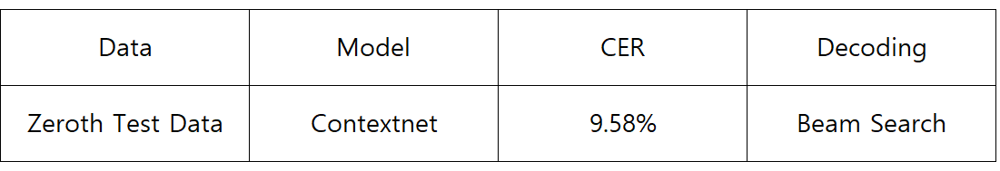

# Contextnet-CTC for Speech Recognition

This repository implements speech recognition using Contextnet-CTC.


## Contextnet

Contextnet is a speech recognition model using SEnet.


## Dataset used in the experiment

[Zeroth dataset](https://www.openslr.org/40/) was used for the experiment. 
Zeroth data is 51.6 hours transcribed Korean audio for training data and 1.2 hours transcribed Korean audio for testing data.

## Experiment

```
python train.py --conf config/contextnet_ctc.yaml
```

## Evaluation

```
python evaluate.py --conf config/contextnet_ctc.yaml
```

## Performance


|Data|Model|CER|WER|Preprocessing|
|----|------|---|---|-------------|
|Eval-Clean|Transformer (β=6)|14%|32%|Filter Bank + SpecAugment|
## Reference

1. [upskyy / Contextnet](https://github.com/upskyy/ContextNet)
2. [moskomule / senet.pytorch](https://github.com/moskomule/senet.pytorch)
3. [burchim / EfficientConformer](https://github.com/burchim/EfficientConformer)

